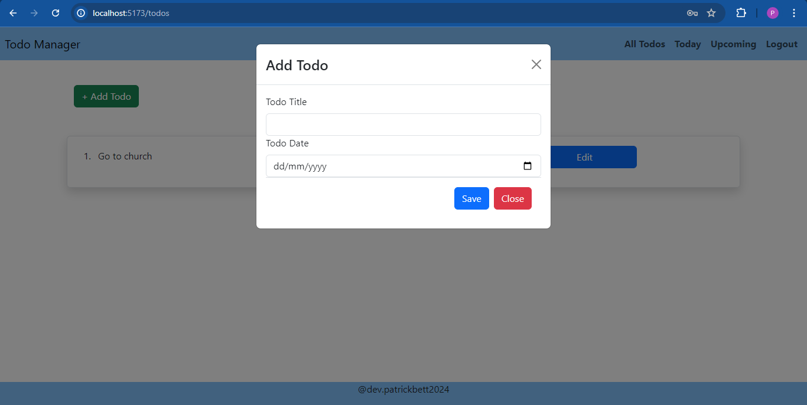

# Todo App Project

## Description

This is a Todo app project built using React for the frontend and Django for the backend. It allows users to sign up, log in, and manage their todos. Authentication is implemented using JWT (JSON Web Tokens).

## Features

User authentication (signup, login)
CRUD operations for todos (Create, Read, Update, Delete)
Responsive design using Bootstrap and custom CSS

## Technologies Used

React
Bootstrap
CSS
Django
JWT (JSON Web Tokens)

## Installation

Clone the repository:

bash
Copy code
git clone https://github.com/your-username/todo-app.git
Navigate to the project directory:
bash
Copy code
cd todo-app
Install dependencies for the frontend (React):
Copy code
npm install
Install dependencies for the backend (Django):
Copy code
pip install -r requirements.txt

## Usage

Start the Django server:
Copy code
python3 manage.py runserver
Start the React development server:
sql
Copy code
npm run dev
Open your browser and visit http://localhost:3000 to use the Todo app.

## Screenshots

